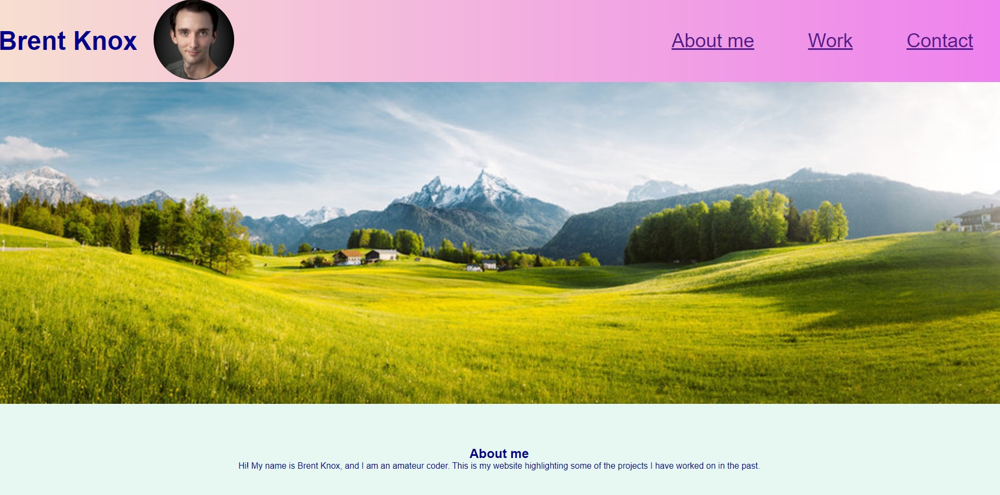
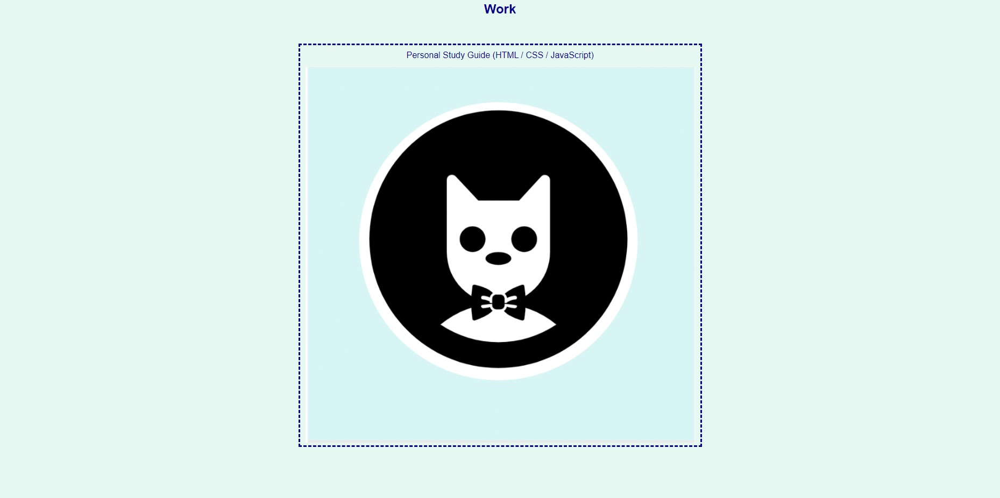

# My Coding Portfolio

## Description

Some day, I am going to be actively looking for job opportunities within the field of computer coding. A helpful step I have taken in that direction is creating this website that will allow me to showcase different websites or programs I have developed or worked on. To be frank, this website will allow me to better access my GitHub repositories that I have deployed through GitHub Pages. Instead of individually clicking through repositories on GitHub to get to their respective deployed pages, this website makes them easily accessible by simply just clicking an image icon for any given repository.

In completing this project, I have learned just how messy it can be to build a website from scratch. I ran into many issues along the way that I did not think I could overcome, but if you are reading this README.md currently, that means I have surmounted those challenges.

## Usage

To use this website, use the naviagation links found in the heading at the top of the page to jump down to those corresponding parts of the page. To view a particular project, click on any of the shown images within the cards under the "Work" category.

Here is the GitHub Pages URL to visit the website:
https://abrentis.github.io/My-Portfolio-Module-2-Challenge/

## License

MIT License (please refer to the GitHub repository for more information)